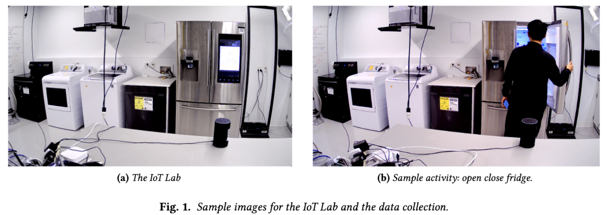
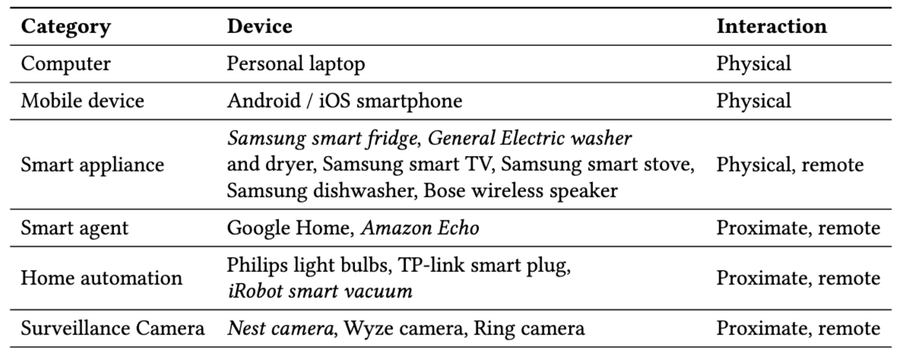
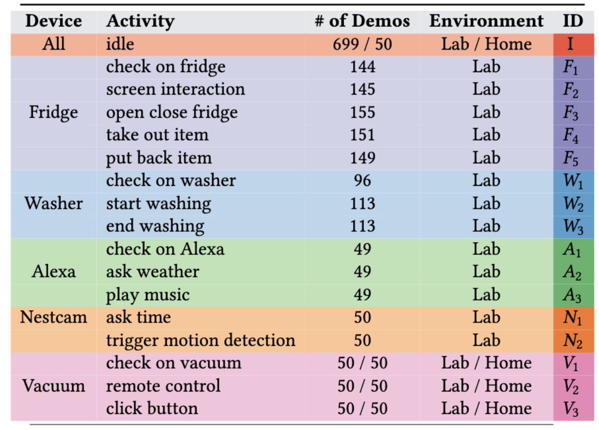
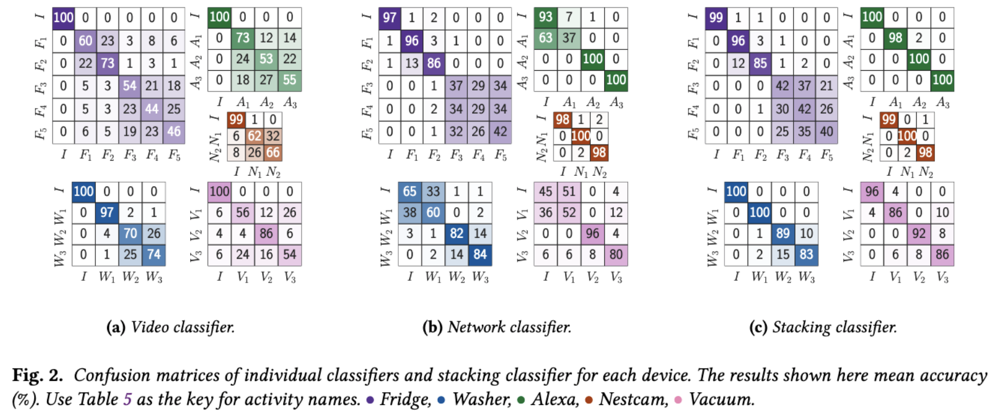
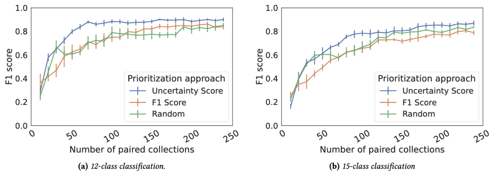

# AMIR: Active Multimodal Interaction Recognition from Video and Network Traffic in Connected Environments

[paper] [code] [datasets] [models]

## Background

Activity recognition using video data is widely adopted for elder care, monitoring for safety and security, and home automation. Unfortunately, using video data as the basis for activity recognition can be brittle, since models trained on video are often not robust to certain environmental changes, such as camera angle and lighting changes. 

There has been a proliferation of network-connected devices in home environments. Interactions with these smart devices are associated with network activity, making network data a potential source for recognizing these device interactions. 

## Method Overview

This paper advocates for the synthesis of video and network data for robust interaction recognition in connected environments. We consider machine learning-based approaches for activity recognition, where each labeled activity is associated with both a video capture and an accompanying network traffic trace. 

It is non-trivial to synthesize two modalities for real-world deployment. We develop a simple but effective framework AMIR (Active Multimodal Interaction Recognition) that trains independent models for video and network activity recognition respectively, and subsequently combines the predictions from these models using a meta-learning framework. 

We aim to minimize the amount of "paired" examples needed to collect to fuse two models. The goal is to derive a distribution of weights for each class to guide the active paired example collection. Details can be found in our technical report.

## Datasets
We release different versions of datasets to cover different research needs, you can find README files within each link.

[dataset] [dataset (ip-filtered)] [processed features] [video-only dataset] [network-only dataset]

To the best of our knowledge, we collect the first dataset that explores the paired observations on video and network traffic. we first choose four most representative devices to collect both physical and proximate interactions. 



To cover a rich variety of devices, the IoT Lab is equipped with 32 IoT devices which are selected based on their commercial shares. We collect a representative device from each category. 



From May 2020 to March 2022, 1960 demonstrations are collected in 3 rounds (about 22.14 hours long data, equivalent to 30 hours of human labor with overhead), with an equal amount of demonstrations across activities for fridge, washer, Alexa and Nestcam. Each demonstration is 40.67 seconds on average of paired observations, with a minimum of 21 seconds and maximum of 138 seconds. In October 2022, an additional round of data (3.14 hours of data, based on six hours of human labor with overhead) is collected, both in the IoT Lab and the smart home, to test the transferability of approach across
physical environments. 




## Models and results
We release our trained models here, with their confusion matrix below.

[video models] [network models] [meta-learning models]



Whether in lab or at home, this approach reduces the amount of “paired” demonstrations needed to perform accurate activity recognition, where both network and video data are collected simultaneously. Specifically, the method we have developed requires up to 70.83% fewer samples to achieve 85% F1 score than random data collection, and improves accuracy by 17.76% given the same number of samples.




## Citation

If you use our datasets/feature sets/models/code, please cite it as:

```markdown
@article{liu2023amir,
    title={AMIR: Active Multimodal Interaction Recognition from Video and Network Traffic in Connected Environments},
    author={Liu, Shinan and Mangla, Tarun and Shaowang, Ted and Zhao, Jinjin and Paparrizos, John and Krishnan, Sanjay and Feamster, Nick},
    journal={Proceedings of the ACM on Interactive, Mobile, Wearable and Ubiquitous Technologies},
    year={2023}
    publisher={ACM Cancún, Mexico}
}


```

## Questions 

If you have questions about this work, please contact `shinanliu@uchicago.edu`.

